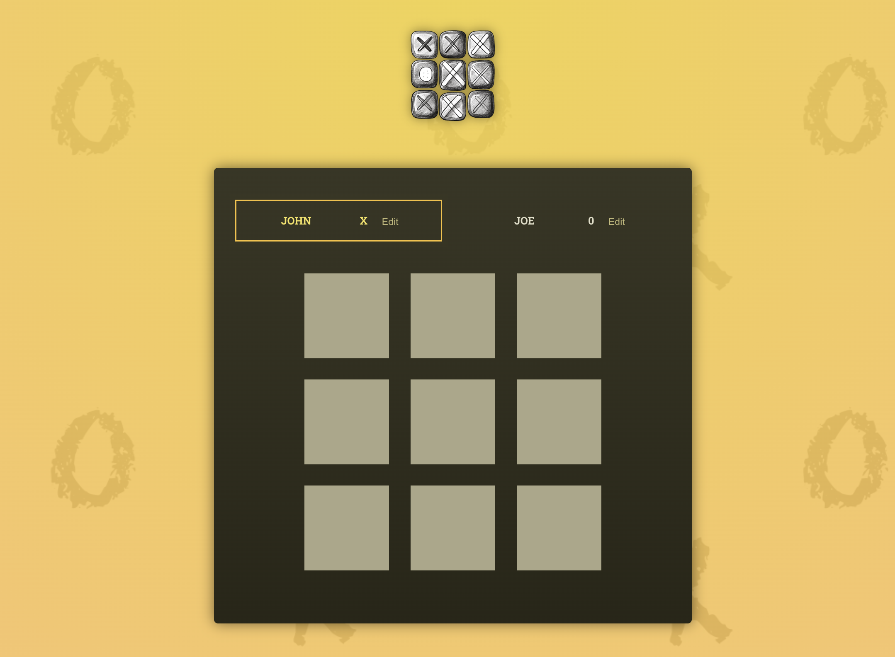
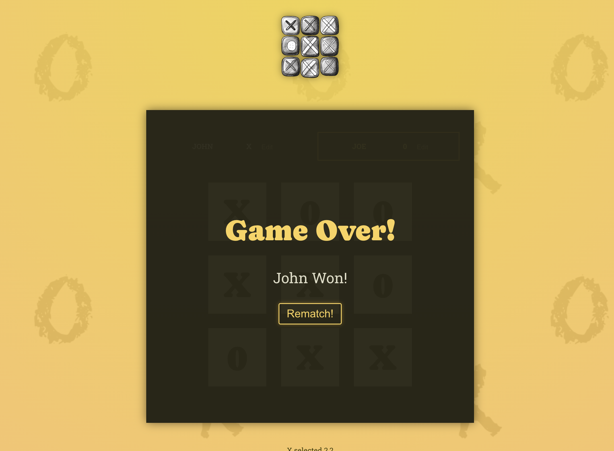

# React Tic Tac Toe Game

This project is a simple Tic Tac Toe game built using React. It allows two players to take turns marking their 'X' or 'O' on a 3x3 grid. The game declares a winner when one player has three of their marks in a row (horizontally, vertically, or diagonally), or it ends in a draw if the grid is full.

## Getting Started

### Prerequisites

Make sure you have [Node.js](https://nodejs.org/) installed on your machine.

### Installation

1. Clone the repository:

   ```bash
   git clone https://github.com/sehaj23/Tic-tac-toe-Game-react.git
   cd react-tic-tac-toe
   npm install
   npm run dev


The application will be available at http://localhost:5173 in your web browser.

# How to Play
Open the game in your browser.
Two players take turns clicking on an empty square to place their mark ('X' or 'O').
The game will automatically detect a winner or a draw and display the result.
To restart the game, click the "Rematch" button.

# Project Structure
The main files and directories in this project are organized as follows:

```
src/: Contains the source code for the React application.
components/: React components used in the application.
App.js: Main application component.
index.js: Entry point of the application.
public/: Contains the HTML file and other static assets.
```

# Contributing
If you find any issues or have suggestions for improvement, feel free to open an issue or create a pull request.


# Screenshot




